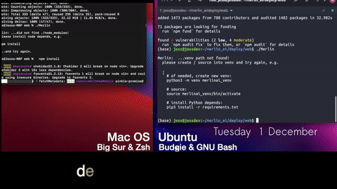

## *Demos, interpreter implementations & data ingress experiments for birdsong ID*


*Jump to:*
- [**Web: Setup**](#setup) <br>
  - [**Setup: npm**](#build) <br>
  - [**Setup: ./Merlin**](#merlin_build) <br>
  - [**Scripts**](#scripts) <br>
  - [**Flask Structure**](#structure) <br>
- [**Leaflet.Annotation**](#leaflet) <br>
- [**Swift UI**](#swift) <br>
- [**React-Native**](#reactnative) <br>
- [**Notes**](#notes) <br>
- [**@ github.io**](https://jesssullivan.github.io/tmpUI/) <br>
- [**@ github repo**](https://github.com/Jesssullivan/tmpUI)
- [**@ Heroku**](https://merlinai.herokuapp.com/)  <br>


- - -


#### *Web Experiments Setup:*


```
# Clone:
git clone --branch=master --depth=1 https://github.com/jesssullivan/tmpUI && cd tmpUI
```

*from `Merlin` command line tool:*
```
# permiss:
sudo chmod +x ./Merlin

# follow the prompts:
./Merlin
```


<h4 id="build"> </h4>     

#### *...with npm:*
```
# node:
npm install

# venv:
python3 -m venv merlinai_venv
source merlinai_venv/bin/activate
pip3 install -r requirements.txt

# build all the things:
npm run-script build-all

# serve:
npm run-script setup-api
npm run-script run-api
```


<h4 id="merlin_build"> </h4>     


#### *...with ./Merlin:*


```
./Merlin
      ___  ___          _ _        ___ _____
      |  \/  |         | (_)      / _ |_   _|
      | .  . | ___ _ __| |_ _ __ / /_\ \| |
      | |\/| |/ _ | '__| | | '_ \|  _  || |
      | |  | |  __| |  | | | | | | | | _| |_
      \_|  |_/\___|_|  |_|_|_| |_\_| |_\___/

Environment:
 -- Auto Setup?        : -as | --auto-setup    :  = false
 -- Check Node?        : -cn | --check-node    :  = true
 -- Check Venv?        : -cv | --check-venv    :  = true
Utilities:
 -- Cleanup Bundles?   : -cb | --clean-bundles :  = false
 -- Cleanup Renders?   : -cr | --clean-renders :  = false
 -- Cleanup compiled?  : -ca | --clean-all     :  = false
 -- Setup Flask?       : -sf | --setup-flask   :  = false
Build:
Pack Demos?            : -d  | --demos         :  = false
Pack Annotators?       : -a  | --annotators    :  = false
Serve?                 : -s  | --serve         :  = false
 -- Flask Server?      : -f  | --flask         :  = false
 -- Node HTTP Server?  : -h  | --http-server   :  = none
 -- Browser CLI?       :   Detected Linux      :  = chromium

```


```
# setup a config.cfg file:
./Merlin -sf
# ^...or like this:
./Merlin --setup-flask

# build & serve everything with flask:
./Merlin --demos --annotators --serve --flask
# ^...or like this:
./Merlin -d -a -s -f

# serve some html using OpenSSL & Node http-server (only for GNU/Linux for the time being)
./Merlin -s --http-server ./demos/webgl_test.html

# rebuild only the annotators:
./Merlin --annotators   

# cleanup rendered html pages:
./Merlin --clean-renders

# clean up all compiled:
./Merlin -ca

# display all arguments & their default state:
./Merlin
```


```
# Experiments MongoDB:
# db lives here, launches as its own process...
mongod --dbpath ./srv/mongodb/ --port 27017

```

```
# Tool will prompt to set up venv & node depends if it hasn't been done yet:
npm install
python3 -m venv merlinai_venv
source merlinai_venv/bin/activate
pip3 install -r requirements.txt
```
- - -


<h4 id="scripts"> </h4>     


#### *Scripts:*

```
# See ./package.json & ./scripts/ for additional scripts
# Most things can be done with ./Merlin command line tool
```


*additional npm scripts:*
```
# build specific things:
npm run-script build-spec-web
npm run-script build-test-web

## cleanup:
npm run-script clean-all

# ...or:
npm run-script clean-bundles
npm run-script clean-renders

# print reference json strucures:
npx ts-node etc/json_refs.ts
```

```
# pack only tool definitions @ `./src/annotator_tool.js:
npm run-script build-anno-tool

# pack only implementations of audio annotator @ `./demos/annotator_audio.ts:
npm run-script build-anno-audio

# pack only implementations of photo annotator @ `./demos/annotator_photo.ts:
npm run-script build-anno-photo
```

#### *local ssl:*
```
# Generates local ssl certs for testing w/ node http-server:
npm run-script sslgen

# you can also provide a $DOMAIN argument like so:
npm run-script sslgen hiyori
# ...returns key `hiyori_key.pem` & cert `hiyori.pem`

# ...or:
sudo chmod +x scripts/sslgen.sh && ./scripts/sslgen.sh
# osx is a bit more finicky
```

#### *tone generator:*

```
### available from here:
cp etc/tone.py .

### generate some .wav files for testing fft things:
python3 tone.py

### ...you can also specify duration in seconds & frequency in Hz like so:
python3 tone.py 5 440

### ...or just duration:
python3 tone.py 2
```


- - -


<h4 id="structure"> </h4>     


#### *Flask Structure:*


```
├── api
  ├── main
    ├── auth
      └── token authentication methods
    ├── client
      └── blueprint for packed web demos
    ├── config
      └── the ./setup script populates a new config.cfg file for Flask,
          using the ##FIELDS## provided in config.cfg.sample
    ├── eventdb
      └── blueprint for ID event database, see notes on ./etc/
    ├── tfmodels
      └── Tensorflow model class and whatnot
    ├── tools
      └── utilities for date/time, expression matching, the like
    └── userdb
      └── blueprint for user authentication database
├── scripts
  └── scripts run by package.json
├── demos
  └── client side pages, demos built w/ webpack
├── src
  └── source directory for client side demos
├── srv
  └── mongodb directory and logs are built here
...

```


<table>
   <thead>
      <tr>
         <th>Demo</th>
         <th>Description</th>
      </tr>
   </thead>
   <tbody>
      <tr>
         <td><a href="./demos/">demos/spec_crop_interpreter</a></td>
         <td>record, crop &amp; interpret. automatically determines client-side or server-side classification method.</td>
      </tr>
      <tr>
         <td><a href="./demos/">demos/webgl_init</a></td>
         <td>Evaluate web client&#39;s capability for classification</td>
      </tr>
      <tr>
         <td><a href="./demos/">demos/annotator_audio</a></td>
         <td>Leaflet.annotator tool implementations for generating, labeling, exporting mel spectrogams as annotation data</td>
      </tr>
      <tr>
         <td><a href="./demos/">demos/annotator_photo</a></td>
         <td>Leaflet.annotator tool implementations for labeling &amp;  exporting photo annotations</td>
      </tr>
   </tbody>
</table>


[](https://www.youtube.com/watch?v=TKKjo1ypSPY&feature=youtu.be "Watch 60 seconds of web features (12/01/20)")


- - -


<h4 id="leaflet"> </h4>     


### *Leaflet.annotation @ tmpUI:*  


<table>
  <thead>
    <tr>
      <th>
        <a href="https://merlinai.herokuapp.com/leaflet_audio"></a>
        <br/><em> Visit Leaflet.annotation Audio demo </em>
      </th>
        <th>
        <a href="https://merlinai.herokuapp.com/leaflet_photo"></a>
        <br/><em> Visit Leaflet.annotation Photo demo </em>
      </th>
    </tr>
  </thead>
</table>


*Hack on Annotator:*


<table>
   <thead>
      <tr>
         <th>Demo</th>
         <th>Description</th>
      </tr>
   </thead>
   <tbody>
      <tr>
         <td><a href="demos/annotator_audio.ts">deploy/demos/annotator_audio</a></td>
         <td>Leaflet.annotator tool implementations for generating, labeling, exporting mel spectrogams as annotation data</td>
      </tr>
      <tr>
         <td><a href="demos/annotator_photo.ts">deploy/demos/annotator_photo</a></td>
         <td>Leaflet.annotator tool implementations for labeling &amp;  exporting photo annotations</td>
      </tr>
      <tr>
         <td><a href="src/annotator_tool.js">deploy/src/annotator_tool</a></td>
         <td>epic <code>Annotator_tool</code> entrypoint, contains class handler functions</td>
      </tr>
   </tbody>
</table>


- - -


<h4 id="swift"> </h4>     


### *Swift Native:*


```
# Hack on Swift stuff:
npm run-script develop-swift-demos
```

-  *focusing on codepaths for:*
    - tflite interpreter
    - ~~generating mel spectrograms~~

- make sure `info.plist` has permissions for microphone access
- **The entrypoint for Swift tests is `./swift/swift-pkgs-tmpui/swift-pkgs-tmpui/swift_pkgs_tmpuiApp.swift`**
- *Toggle various interpreter experiments from entrypoint*

#### Other Linker Libraries:

*Project:*

```
$(inherited)
-force_load Pods/TensorFlowLiteSelectTfOps/Frameworks/TensorFlowLiteSelectTfOps.framework/TensorFlowLiteSelectTfOps
-force_load Pods/TensorFlowLiteC/Frameworks/TensorFlowLiteC.framework/TensorFlowLiteC
-force_load Pods/TensorFlowLiteC/Frameworks/TensorFlowLiteCCoreML.framework/TensorFlowLiteCCoreML
-force_load Pods/TensorFlowLiteC/Frameworks/TensorFlowLiteCMetal.framework/TensorFlowLiteCMetal
-ObjC
-l"c++"
```


*Target:*

```
-force_load Pods/TensorFlowLiteSelectTfOps/Frameworks/TensorFlowLiteSelectTfOps.framework/TensorFlowLiteSelectTfOps
-force_load Pods/TensorFlowLiteC/Frameworks/TensorFlowLiteC.framework/TensorFlowLiteC
-force_load Pods/TensorFlowLiteC/Frameworks/TensorFlowLiteCCoreML.framework/TensorFlowLiteCCoreML
-force_load Pods/TensorFlowLiteC/Frameworks/TensorFlowLiteCMetal.framework/TensorFlowLiteCMetal
-ObjC
-l"c++"

```

```
# niftily switch between xcode versions:
sudo xcode-select --switch ~/Downloads/Xcode-beta.app
```

#### Interpreter Operations:

*Hack on fft functions:*
*[*./etc/tone.py:*](https://github.com/Jesssullivan/tmpUI/blob/master/etc/tone.py)*

```
### copy from here:
cp etc/tone.py .

### generate some .wav files for testing fft things:
python3 tone.py

### ...you can also specify duration in seconds & frequency in Hz like so:
python3 tone.py 5 440

### ...or just duration:
python3 tone.py 2
```

*some fft-related links*
  - simplest (beware some typos)
    - https://stackoverflow.com/questions/32891012/spectrogram-from-avaudiopcmbuffer-using-accelerate-framework-in-swift
    - https://gist.github.com/jeremycochoy/45346cbfe507ee9cb96a08c049dfd34f

  - *"krafter" has a nice clear working sketch:*
    - https://stackoverflow.com/questions/11686625/get-hz-frequency-from-audio-stream-on-iphone/19966776#19966776

  - accelerate & apple docs:
    - https://developer.apple.com/documentation/accelerate/equalizing_audio_with_vdsp
    - https://developer.apple.com/documentation/accelerate/vdsp/fast_fourier_transforms
    - https://medium.com/better-programming/audio-visualization-in-swift-using-metal-accelerate-part-1-390965c095d7


- - -


<h4 id="reactnative"> </h4>     


### *React Native:*


#### *Install & link Cocoa depends to get cracking on the ios demos:*

```
# link ios depends:
cd ios && pod install && cd ..
```

- **The entrypoint for react-native tests is `./index.js`, fiddle @ `./native/`.**


#### *Build & deploy to Xcode Simulator:*

```
# link ios depends:
npm run-script ios-native
```


- - -


# Notes:    


***Rolling notes and whatnot are appended to bottom of readme***


- `tmpui-testing` dyno used sporadically for debugging, keeping it @ maintenance mode atm
- Use `heroku buildpacks:add --index 1 heroku-community/apt -a tmpui` for librosa vorbis depend


*Macaulay Annotation:*

- Since Macaulay recording are already pretty well labeled by species, what if we make human annotations into a learning game of sorts?  i.e. In order for the user to guess, they must crop in on the song they are guessing on- free annotation lunch?
   - We already know what the target species is, so even if they get it wrong while they learn a new song, we still get a labeled annotation

- Get humans annotating asap, ideally with a fun / educational twist
  - it would be so cool to be able to hook up a bunch of ornithology professors and students up and down New England with a song study / game tool of sorts
  - Would be fun to add this annotation-centered song learning rgame feature to the hybrid app, may be more helpful in the near term than field annotation

- Another similar thread to the same end is automating the annotation / boxing of Macaulay recordings-
   - Could get pretty far with the existing species labels + vetting with time / date + a highpass filter, though this has less to do with UX and more with getting a jump on adding data for a more accurate model
   - Similarly, since the only real task here is to isolate vocalizations (not id vocalizations)- detecting “Clearly a bird sound vs. not a bird sound”- for each recording, for each species- could be automated to operate without human assistance.


*Field Annotation:*

* User records a song; song spectrogram is cropped, annotated as either an already ID'd species or unknown song
  * this way, every song encountered is added to the data pool, corroborating or reshaping future models
  * Merlin's model returns user its best deduction for "unknown song"- user should be able to audit each possible species (via allaboutbirds or something) and verify the correct species
  * Aiming to make project contribution simple; easy to add to as many audio-enabled devices and projects as possible

* How will annotation become part of new and exciting features (instead of a data cleaning task / tedium?)
  * ...what if audio is recorded during an eBird checklist, such that a user can tick a box when a bird is ID'd by ear, adding the species & timestamp?
  * ...could be "gamified" as part of the undergraduate Ornithology curriculum?
  * ...what if audio collection & annotation could be easily implemented on a Raspberry Pi, or incorporated into STEM curriculums?
  * ...part of some kind of feederwatch kiosk, allow easy guest annotations?

* Investigate adding non-audio data to both model and vetting process-
  * date & coordinates would narrow options considerably, an account of general surrounding habitat would result in just a handful of possible species at most
  * Recent or historical ebird check ins at same date / location would also improve accuracy and narrow possibilities
  * how could attributes like these remain “optional but really preferable” in a generic set of annotation tools / pipeline before generating TFRecords?
  * How might this inform and provide feedback to a compiled model as well?

* how to most effectively bundle waveform/spectrogram/annotations?
 * could annotations be bundled as an "album/song" metadata?

*Script stuff:*

- begin experimenting with auto detecting bird songs on the fly
 - ...could be used in conjunction with the web tools & interface in browser / local web app, "kiosk style":
   - computer / Raspberry Pi / bird feeder stream on youtube / etc constantly processing audio stream, try to classify any sounds that might be a bird, etc
   - web app served locally from cloned notebook, encourage fiddling
   - make interface to pit Merlin's guesses against user's annotation of clip, etc
 - ...could also be used for "minimal human assistance" bulk collection of annotations via Macaulay, video stream, bird cams, etc


*Web stuff:*

- modify web annotator to generate spectrogram in the browser instead of fetching a pre generated one
- add some audio --> spectrogram controls to web annotator for better annotations:
 - add playback of  cropped / modified spectrogram audio as well!
 - modify spectrogram to better box all songs

*Other stuff:*

- add export TFRecord function?  could fit [everything in ID3?](https://en.wikipedia.org/wiki/ID3) Bundle spectrogram as "album artwork", cropped / uncropped audio as "tracks", json attributes as album info?
- still want to eventually figure out TensorFlow with web assembly instead of webgl for mobile, perhaps later?  thoughts on this?


*demos, annotators ***Π*** competitiveness*

a ***single annotation*** as first class entry in database:

<br/>

|id|category_id|supercategory|media_source|attribution|bbox|user_id|
|---|---|---|---|---|---|---|
| unique annotation identifier |species, etc  | family, genus, etc | url to media being annotated; for browser spectrogram demo, this is the `audio` field; otherwise linked via `image_id` needn't be Macaulay specific |attribution to media source; author; link to media's license| bounding array of annotation box |registered individual who made the annotation|

<br/>

- database of annotations may hold many entries describing the same media, by different users

- unregistered users may annotate and play with tools as much as they want, cannot save / contribute their annotations

- untrusted (new) registered users may save / contribute their annotations with a confidence level of 1

- trusted registered users with more than 5 or more trust points may save / contribute their annotations with a confidence level of 1 or 2 (e.g. duplicate their annotation) (or 0 / just don't save that annotation)

- a user may become trusted if 3 of their annotations contribute to completed annotations

- to complete an annotation, entries of **X** media must be replicated **Y** times- e.g. identical `catagory`, `supercatagory`, `bbox` centroid is within **T** threshold of each other (`bbox` values can be averaged to single annotation)

- users cannot modify existing annotations, that's cheating

- [just began enumerating features here on Figma](https://www.figma.com/file/CgscKZmdW3WKN3JGkjQsU7/WebAnnotatorFeatureNotes12.03.20?node-id=7%3A5536)

- - -


- *an entry, interoperable w/ Lab of O:*
```
{'id': 'c466fac6-5c77-4725-9e1a-5627c190ce08',
 'bbox': [0.03729166507720947,
  0.31716904264146634,
  0.0096875,
  0.3799303977272727],
 'user_id': '123abc',
 'image_id': 123456789,
 'username': 'abc123',
 'category_id': 'swaspa',
 'supercategory': 'Bird'
}
```


*todo:*
- what if a user is really untrustworthy?
- send, share wireframe figma to slack people asap
- bring all the cool new audio features added to Leaflet.annotation into record --> crop --> classify demo:
    - playback spectrogram with audio
    - scrubbing via keyboard / buttons
    - cropping / bbox features-
     - seems it'd be most efficient to just generate new local annotation in browser upon record,
       use the same annotator bundle to handle all these functions.
     - fix crop behavior for serverside classification ^ this way, generate and POST new `snippet.wav` by `bbox`
       (instead of classify entire recording)


 *todo:*
 - Get queue working somewhere online;
   - It'd be great to be able to use the current Cornell annotator infrastructure (eBird authentication, "to be annotated" list from ML, etc)
 - create an interface to let users visualize the model (tsne)
     - create an interface to let users make a queue, e.g. "wood warbler songs" or "high-confidence false IDs" or "new world sparrows"
 - queued ID events served either:
     - ...from a single database with id events as first class objects
          - (^ Jess is starting here this week (1/05-1/12))
     - ...from equivalents to annotations, categories, config, images json files, selected by the "id" field
 - would be terrific to get the react stuff working at `>17.*` and `webpack-dev-server` or `react-scripts`, consolidate lint and tsconfig rules etc


<h4 id="notes"> </h4>     


#### *^ Rolling notes and whatnot are appended above ^*
